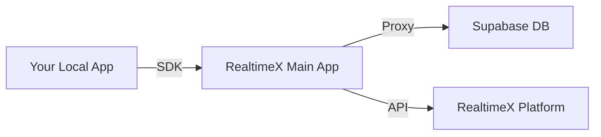

# RealtimeX Local App SDK

Official SDK for building **Local Apps** that integrate seamlessly with [RealtimeX](https://realtimex.ai). This SDK provides a simplified interface to manage activities, trigger AI agents, and access RealtimeX platform APIs.

---

## 🚀 Features

- **Activity Management**: Easily insert, update, and query activities in your Supabase database.
- **AI Agent Integration**: Trigger RealtimeX agents for automated processing or manual review.
- **Platform APIs**: Access workspaces, agents, threads, and task statuses programmatically.
- **Auto-Configuration**: Zero-config setup when running within the RealtimeX environment.
- **Cross-Platform**: Available for both TypeScript/JavaScript and Python.

---

## 📦 Available SDKs

| Language | Package | Installation | Documentation |
|----------|---------|--------------|---------------|
| **TypeScript / JS** | [`@realtimex/sdk`](https://www.npmjs.com/package/@realtimex/sdk) | `npm install @realtimex/sdk` | [TypeScript README](./typescript/README.md) |
| **Python** | [`realtimex-sdk`](https://pypi.org/project/realtimex-sdk/) | `pip install realtimex-sdk` | [Python README](./python/README.md) |

---

## 🛠 Prerequisites

Before using the SDK, you must configure your Local App via the **RealtimeX Main App**:

1. Open **RealtimeX** → **Settings** → **Local Apps**.
2. Create or select your Local App and click **Configure**.
3. Enter your Supabase **URL** and **Anon Key**.
4. Select **Compatible Mode** → **Login to Supabase** → **Auto-Setup Schema**.

> **Note:** The RealtimeX Main App handles all database schema migrations automatically. No manual SQL is required.

---

## 💡 Quick Start

### TypeScript / JavaScript
```typescript
import { RealtimeXSDK } from '@realtimex/sdk';

const sdk = new RealtimeXSDK();

// Insert an activity
const activity = await sdk.activities.insert({
  type: 'new_lead',
  email: 'user@example.com',
});

// Trigger an agent to process it
await sdk.webhook.triggerAgent({
  raw_data: activity,
  auto_run: true,
  agent_name: 'lead-processor',
  workspace_slug: 'sales'
});
```

### Python
```python
import asyncio
from realtimex_sdk import RealtimeXSDK

async def main():
    sdk = RealtimeXSDK()
    
    # Insert an activity
    activity = await sdk.activities.insert({
        "type": "new_lead",
        "email": "user@example.com"
    })
    
    # Trigger an agent
    await sdk.webhook.trigger_agent(
        raw_data=activity,
        auto_run=True,
        agent_name="lead-processor",
        workspace_slug="sales"
    )

asyncio.run(main())
```

---

## 🏗 Architecture

The SDK acts as a lightweight client that communicates with the **RealtimeX Main App**, which serves as a secure proxy to your Supabase database and the RealtimeX platform.



---

## ⚙️ Environment Variables

When your Local App is launched by the RealtimeX Main App, the following variables are injected automatically:

| Variable | Description |
|----------|-------------|
| `RTX_APP_ID` | Your app's unique identifier. |
| `RTX_APP_NAME` | Your app's display name. |

---

## 📄 License

Distributed under the MIT License. See `LICENSE` for more information.

---

## 🤝 Support

- **Website**: [realtimex.ai](https://realtimex.ai)
- **Documentation**: [Full API Docs](https://docs.realtimex.ai)