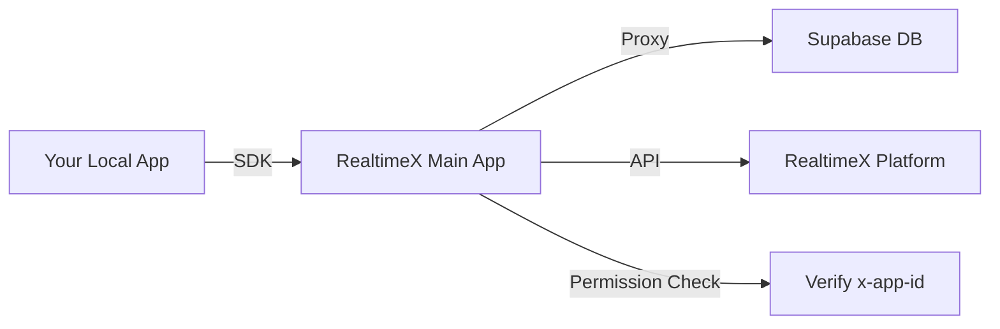

# RealtimeX Local App SDK

Official SDK for building **Local Apps** that integrate seamlessly with [RealtimeX](https://realtimex.ai). This SDK provides a simplified interface to manage activities, trigger AI agents, and access RealtimeX platform APIs.

---

## 🚀 Features

- **Activity Management**: Easily insert, update, and query activities in your Supabase database.
- **AI Agent Integration**: Trigger RealtimeX agents for automated processing or manual review.
- **Platform APIs**: Access workspaces, agents, threads, and task statuses programmatically.
- **AI capabilities**: Chat, streaming, and embeddings through RealtimeX LLM proxy.
- **Managed Vector Storage**: Isolated vector storage for RAG patterns.
- **Auto-Configuration**: Zero-config setup when running within the RealtimeX environment.
- **Permission System**: Granular permission control for secure API access.
- **Cross-Platform**: Available for both TypeScript/JavaScript and Python.

---

## 📦 Available SDKs

| Language | Package | Installation | Documentation |
|----------|---------|--------------|---------------|
| **TypeScript / JS** | [`@realtimex/sdk`](https://www.npmjs.com/package/@realtimex/sdk) | `npm install @realtimex/sdk` | [TypeScript README](./typescript/README.md) |
| **Python** | [`realtimex-sdk`](https://pypi.org/project/realtimex-sdk/) | `pip install realtimex-sdk` | [Python README](./python/README.md) |

---

## 🛠 Prerequisites

Before using the SDK, you must configure your Local App via the **RealtimeX Main App**:

1. Open **RealtimeX** → **Settings** → **Local Apps**.
2. Create or select your Local App and click **Configure**.
3. Enter your Supabase **URL** and **Anon Key**.
4. Select **Compatible Mode** → **Login to Supabase** → **Auto-Setup Schema**.

> **Note:** The RealtimeX Main App handles all database schema migrations automatically. No manual SQL is required.

---

## 🔐 Authentication & Permissions

### App ID Header (Production Mode)

All SDK API calls require authentication. When running within the RealtimeX environment, this is handled automatically using the `x-app-id` header.

The SDK reads the `RTX_APP_ID` environment variable (injected by RealtimeX when starting your app) and includes it in all API requests.

### API Key (Development Mode)

For local development without registering an app in the UI, you can use an **API Key** from **Settings > API Keys**. This grants full access to SDK endpoints without requiring specific permission prompts.

The SDK will use the `Authorization: Bearer {API_KEY}` header when an API key is provided via configuration or `RTX_API_KEY` environment variable.

### Permission System (v1.0.8+)

RealtimeX uses a **manifest-based permission system**. When initializing the SDK, you declare the permissions your app needs. RealtimeX will ensure these permissions are granted (prompting the user if necessary) before your app starts.

#### Declaring Permissions

| Permission | Description | API Access |
|------------|-------------|------------|
| `api.agents` | List agents | `sdk.api.getAgents()` |
| `api.workspaces` | List workspaces | `sdk.api.getWorkspaces()` |
| `api.threads` | List threads | `sdk.api.getThreads()` |
| `api.task` | Get task status | `sdk.api.getTask()` |
| `webhook.trigger` | Trigger agents | `sdk.webhook.triggerAgent()` |
| `llm.chat` | LLM Chat | `sdk.llm.chat()` / `sdk.llm.chatStream()` |
| `llm.embed` | LLM Embeddings | `sdk.llm.embed()` |
| `llm.providers` | List providers | `sdk.llm.getProviders()` |
| `vectors.read` | Read vectors | `sdk.llm.vectors.query()` |
| `vectors.write` | Write vectors | `sdk.llm.vectors.upsert/delete()` |
| `activities.read` | Read activities | `sdk.activities.list()` |
| `activities.write` | Write activities | `sdk.activities.insert/update/delete()` |

### Runtime Prompts

If your app tries to call an API without a declared permission, the SDK will automatically request the permission at runtime and re-attempt the call after the user grants it.

---

## 💡 Quick Start

### TypeScript / JavaScript
```typescript
import { RealtimeXSDK } from '@realtimex/sdk';

const sdk = new RealtimeXSDK({
  permissions: ['activities.write', 'webhook.trigger']
});

// Insert an activity (SDK handles permission prompt if needed)
const activity = await sdk.activities.insert({
  type: 'new_lead',
  email: 'user@example.com',
});

// Trigger an agent to process it
await sdk.webhook.triggerAgent({
  raw_data: activity,
  auto_run: true,
  agent_name: 'lead-processor',
  workspace_slug: 'sales'
});
```

### Python
```python
import asyncio
from realtimex_sdk import RealtimeXSDK, SDKConfig

async def main():
    # Declare permissions in config
    sdk = RealtimeXSDK(config=SDKConfig(
        permissions=['activities.write', 'webhook.trigger']
    ))
    
    # Insert an activity
    activity = await sdk.activities.insert({
        "type": "new_lead",
        "email": "user@example.com"
    })
    
    # Trigger an agent
    await sdk.webhook.trigger_agent(
        raw_data=activity,
        auto_run=True,
        agent_name="lead-processor",
        workspace_slug="sales"
    )

asyncio.run(main())
```

---

## 🏗 Architecture

The SDK acts as a lightweight client that communicates with the **RealtimeX Main App**, which serves as a secure proxy to your Supabase database and the RealtimeX platform.



---

## ⚙️ Environment Variables

When your Local App is launched by the RealtimeX Main App, the following variables are injected automatically:

| Variable | Description |
|----------|-------------|
| `RTX_APP_ID` | Your app's unique identifier (Production Mode). |
| `RTX_API_KEY` | Your API key from settings (Development Mode). |
| `RTX_APP_NAME` | Your app's display name. |
| `RTX_PORT` | Suggested port for your app (optional). |

> **Important:** Either `RTX_APP_ID` or `RTX_API_KEY` is required for API access.

---

## 📄 License

Distributed under the MIT License. See `LICENSE` for more information.

---

## 🤝 Support

- **Website**: [realtimex.ai](https://realtimex.ai)
- **Documentation**: [Full API Docs](https://docs.realtimex.ai)